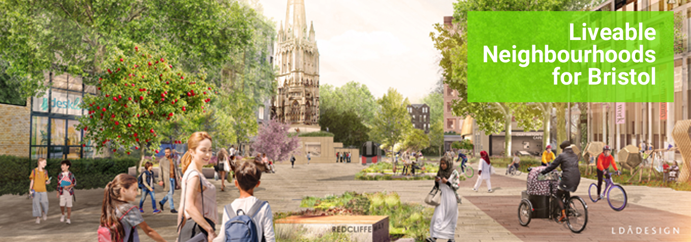

# ln4b

ln4b ('Liveable Neighbourhoods for Bristol') is a static site owned by [Bristol Cycling Campaign](https://bristolcycling.org.uk).

It campaigns for [liveable and low traffic neighbourhoods](https://liveablebristol.org.uk/) in Bristol, UK.



The site was created from scratch using HTML and CSS. [Sass](https://sass-lang.com/) is used as the CSS compiler. [BEM](http://getbem.com/) is used for naming visual components. [Bootstrap](https://getbootstrap.com) is used for styling some components (buttons, form fields), though everything else (including layout) uses CSS3.

## Setup

Follow the steps below to get started with the project:

1. [Install `git`](https://git-scm.com/book/en/v2/Getting-Started-Installing-Git).

2. [Install `sass`](https://sass-lang.com/install).

3. Clone this repo to your machine. (Learn how [here](https://docs.github.com/en/github/creating-cloning-and-archiving-repositories/cloning-a-repository).)

4. In the terminal, set up Sass to watch all stylesheets in `styles/sass/` and compile them in to `styles/css/`:

```
$ sass --watch styles/sass:styles/css
```

5. Make changes to the website and test locally.

### Deployment to staging

6. Push to GitHub on the `master` branch. Changes will be made live on the staging site at [`https://zackads.github.io/ln4b`](https://zackads.github.io/ln4b).

### Deployment to production

7. If changes are accepted once in staging, push to production by logging in to [Buddy](https://app.buddy.works/). (You may need additional permissions to do this; speak to Zack).

## Git workflows

Due to the simple nature and limited scope of this site, we push directly to `master` and roll back if we don't like the changes. There is no need to create a new feature branch unless the change is substantial (e.g. adding an additional page or re-designing the site).

## Local group postcode lookup

The "Find your local group on Facebook" CTA (`#postcode-lookup`) works like this:

1.  User enters postcode and submits form.

2.  App queries the [postcodes.io](http://postcodes.io/) API, attempting to get the ward the postcode is in.

3.  If postcode-to-ward lookup via postcodes.io API succeeds, app looks up the user's ward in `assets/data/ln_groups.json`.

4.  If ward-to-Facebook-group lookup via `ln_groups.json` succeeds, app links the user to their local Liveable Neighbourhoods Facebook group.

5.  If either of the lookups fail, app serves an error message and invites the user to get in touch with the Liveable Bristol campaign via email.

The moderately self-documenting code for this is in `script.js`.

## Change requests

Change requests from non-developers should be submitted as a Slack message in the [#ltn-microsite](https://bristolcycling.slack.com/archives/G016633DZ0C) channel in a format similar to:

```
Change request:  Add Eastside Community Trust logo.
Logo is in the usual folder.  Hovertext to be "Eastside
Community Trust".  Hyperlink to be "www.eastsidecommunity.com"
```

A developer can then 'assign' the change request to themselves with a comment, and mark as done with a green tick emoji.

### New Liveable Neighbourhood groups

If a new Liveable Neighbourhood Facebook group needs to be added, simply append a new property to the existing JSON in `ln_groups.json` following this schema:

```json
  "<ward name>": {
    "name": "<Facebook group name>",
    "url": "<Facebook group URL>"
  },
```

For example:

```json
  "Eastville": {
    "name": "LNs for Eastville and Fishponds",
    "url": "https://www.facebook.com/groups/289211205662975"
  },
```

\<ward name\> must exactly match the official ward name. If in doubt check the return value from the [postcode.io API](https://postcodes.io).

> ❌ Incorrect ward name: `Hengrove & Whitchurch Park`
>
> ✅ Correct ward name: `Hengrove and Whitchurch Park`

## Get in touch

Reach out to either Zack or Alex M on the Bristol Cycling Campaign Slack workspace or contact [hello@liveablebristol.org.uk](mailto:hello@liveablebristol.org.uk).
